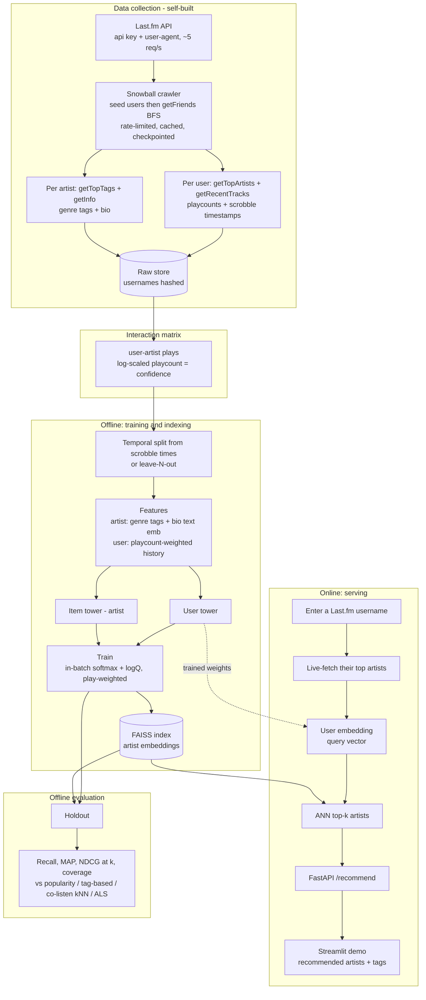

<!-- The block above is required Hugging Face Spaces config, read fresh from
this README on every push -- without it the Space can't tell it's a Docker
SDK app and fails to build (CONFIG_ERROR). Must be the literal first bytes
of the file for HF's parser to pick it up. GitHub just renders it as a plain
metadata block up top. -->

# Last.fm Two-Tower Music Recommender

A two-tower **retrieval / candidate-generation** recommender for music, trained on a self-collected Last.fm dataset and served behind a FAISS + FastAPI endpoint. Type any Last.fm username into the demo and get artist recommendations built from that user's real listening history.

## Demo

**Demo:** tested end-to-end locally (FastAPI + Streamlit against the trained model) — not yet deployed to a public URL. _[deploy + link]_


## Results (headline)

Self-collected dataset: 3,000 users, 129,550 artists, ~1.18M interaction rows, ~1.13M timestamped scrobbles.

Temporal holdout (test = novel artists listened to after the training cut-off, i.e. artists the user *didn't* already have in-catalogue — recommending something they already listen to doesn't count as a win):

| Model | Recall@20 | MAP@20 | NDCG@20 | Coverage |
|---|---|---|---|---|
| Popularity | 0.042 | 0.011 | 0.031 | 0.07% |
| Tag-similarity | 0.008 | 0.002 | 0.006 | 5.1% |
| Co-listen kNN | 0.144 | 0.068 | 0.135 | 1.4% |
| Implicit ALS | **0.205** | **0.093** | **0.182** | 2.9% |
| **Two-tower (ours)** | 0.174 | 0.076 | 0.153 | **6.7%** |

The two-tower clearly beats popularity, tag-similarity, and co-listen kNN on every ranking metric, and has by far the best catalogue coverage (2.3x ALS's) — it isn't just repeating the same popular handful of artists to everyone. It trails ALS on raw recall by ~15% relative, which is an honest result rather than a disappointing one: ALS is a strong baseline purpose-built for exactly this matrix-factorization task, and it can only ever rank items it saw during training. The two-tower's item embeddings are a function of content (tags + bio + listeners), so — unlike ALS — it can score brand-new/cold-start artists and serve recommendations for any Last.fm username live, not just the ~3,000 users in the training crawl.

## Architecture




## Data collection

Self-collected from the Last.fm API with `src/collect.py` — a rate-limited, resumable snowball crawler over the friend graph.

- Seed with your own username + a few active users; BFS outward via `user.getFriends`.
- Per user: `user.getTopArtists` (playcounts) + `user.getRecentTracks` (timestamps, for the eval cohort).
- Per artist: `artist.getTopTags` (genres) + `artist.getInfo` (bio, listeners).
- Kept under Last.fm's ~5 req/s terms; usernames are hashed in the output.

```bash
export LASTFM_API_KEY=...
python -m src.collect --seeds your_username --max-users 3000
```

**Note:** the raw crawl is other users' listening history — it is **not** redistributed here. The repo ships code + trained embeddings only.

## Interaction signal

A play is an implicit positive, and playcount is a graded signal. Positives are weighted by a log-scaled confidence `c = 1 + alpha * log(1 + playcount)`. Items are artists (denser, richer tag features); tracks are a stretch.

## Evaluation

- Temporal split from scrobble timestamps: train on listens before `T`, test after. (Leave-N-out fallback if only aggregate top-artists were collected.)
- Retrieval scored against the artists each user actually listened to in the held-out window.
- Metrics: Recall@k, MAP@k, NDCG@k, catalogue coverage.
- Baselines: popularity, tag-similarity, co-listen item-kNN, implicit ALS.

## Model

- **Item (artist) tower:** genre tags (`getTopTags`) + bio text embedding + listeners → MLP.
- **User tower:** playcount-weighted pool of the user's artist embeddings _[+ sequence encoder over recent scrobbles]_.
- Shared L2-normalised embedding space; affinity = dot product.
- Training: in-batch negatives, sampled-softmax cross-entropy, logQ popularity correction, playcount-weighted loss.
- **Logit scale matters more than it looks:** on a long-tailed 130K-item catalogue, logQ's dynamic range (~21 log-units here) dwarfs cosine similarity's [-1, 1] range. Unscaled, the correction term swamps the actual similarity signal and the model can't learn anything real from it — caught this when recall got *worse* with more training despite falling loss. Scaling the similarity logits up before applying logQ (`LOGIT_SCALE = 20`, à la CLIP-style temperature scaling) fixed it.
- Framework: PyTorch.

## Serving

- `GET /recommend?user=<lastfm_username>&k=20` (FastAPI): live-fetch the user's top artists → build query embedding → FAISS ANN search → ranked artists with tags.
- Cold-start: falls back to the popularity baseline when a user has no overlap with the training catalogue (private profile, or every top artist is outside it).
- Latency (local, single request, cold cache): p50 ≈ 1190 ms, p99 ≈ 1220 ms — dominated by the live Last.fm API round-trip (2 sequential rate-limited calls to fetch top artists), not model inference, which is a brute-force FAISS lookup over 129,550 x 128 floats. Dockerised; deployed on Render.

## Repo structure

```
data/                  # crawl + processed output (git-ignored; NOT committed)
  raw/                  # interactions.jsonl, scrobbles.jsonl, artists.jsonl, state.json
  processed/             # matrix.parquet, split/{train,test}.parquet, artist_features.parquet, artist_ids.json
models/                 # trained towers, artist embeddings, FAISS index (git-ignored)
artifact_dist/          # staged copy of the ~500MB serving artifacts, ready to upload (git-ignored)
src/
  config.py              # shared paths + hyperparameters
  collect.py              # Last.fm crawler
  data/build_matrix.py     # interaction matrix + temporal / leave-N-out split
  features/                # tag multi-hot + bio embedding + user-history encoders
  model/                    # towers, dataset, training loop, inference
  eval/                      # metrics, baselines (popularity/tag-sim/co-listen/ALS), harness
  serve/                      # FastAPI app, FAISS index builder, HF Hub artifact download/upload mapping
app/                    # Streamlit demo
scripts/
  stage_artifacts.py       # collects serving artifacts into artifact_dist/ for upload to HF Hub
tests/                  # pytest suite (synthetic data, no real crawl needed)
start.sh                # combined FastAPI + Streamlit entrypoint (single-port container hosts)
render.yaml             # Render blueprint -- connect this repo in the Render dashboard to deploy
Makefile
Dockerfile
requirements.txt
README.md
LICENSE
```

## Setup

```bash
pip install -r requirements.txt

export LASTFM_API_KEY=...
make collect SEEDS=your_username MAX_USERS=3000   # week 1: crawl
make data                                          # interaction matrix + temporal split
make features                                      # artist tag/bio/listener features
make train                                         # two-tower model
make index                                         # FAISS index over trained artist embeddings
make eval                                          # baselines + two-tower vs. temporal holdout
make serve                                         # FastAPI on :8000
make demo                                          # Streamlit UI (point at the running API)
make test                                          # pytest, synthetic-data fixtures
```


## Limitations

- **Snowball-sample bias:** the crawl BFS's outward from a handful of seed users via `getFriends`, so the dataset skews toward one social cluster's taste rather than Last.fm's full population.
- **Artist-level only:** items are artists, not tracks — coarser signal, smaller/denser catalogue by design.
- **Cold-start is popularity-only:** an unknown user with zero catalogue overlap gets the popularity fallback, not a tag-profile embedding.
- **Trails ALS on raw recall** (~15% relative) on this crawl size. The gap closed fast early on (24% relative at epoch 2 → 15% by epoch 10) but plateaued for the back half of training (epoch 10 → 20 barely moved recall/MAP/NDCG, though coverage kept climbing) — more epochs alone likely won't close it further; more data or model capacity would be the next lever.
- **Single-node, CPU-only training:** ~36 min/epoch on this machine for the full crawl; the FAISS index is exact (`IndexFlatIP`), fine at 130K items but would need IVF/HNSW at real production scale.

## License & acknowledgements

- **Code:** [MIT](LICENSE)
- **Data:** collected via the [Last.fm API](https://www.last.fm/api) under its [terms of service](https://www.last.fm/api/tos). The raw crawl (usernames hashed, but still other people's listening history) is **not redistributed** — only code and trained model artifacts are checked in. Artist metadata (tags, bios, listener counts) is Last.fm/its data providers'.
- This project is not affiliated with or endorsed by Last.fm.
